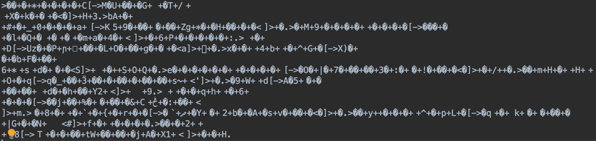

# Let's make your Esolang!
 
  
Do you know "Esoteric programming language (esolang)"?
It's a very difficult language to understand its meaning.
For example, it includes Brainf*ck, Malbolge and Piet.  
  
These codes I offer help you make an esolang based on Brainf*ck easily!

# First: pure Brainf*ck interpreter
Original Brainf*ck code
```text
+++++++++[->++++++++>+++++++++++>+++++<<<]>.>++.+++++++..+++.>-.---------
---.<++++++++.--------.+++.------.--------.>+.
```

Compile and decode
```console
$ cd PROJECT_ROOT
$ mkdir build
$ cd build
$ cmake ..
$ make
$ ./bfi ../hello.bf
Hello, world!
```

You can use the code [main.cpp](main.cpp) as a Brainf*ck interpreter like this if you don't modify.

# Second: modify BF orders
In [orders.cpp](orders.h), you can find the orders of Brainf*ck.

```cpp
#define PTR_INCREMENT   '>'
#define PTR_DECREMENT   '<'
#define BYTE_INCREMENT  '+'
#define BYTE_DECREMENT  '-'
#define OUTPUT          '.'
#define INPUT           ','
#define LOOP_START      '['
#define LOOP_END        ']'
```

You can change these orders to yours, and YOUR esolang is done !

## For Example ...
If you replace the orders with
```cpp
#define PTR_INCREMENT   'a'
#define PTR_DECREMENT   'b'
#define BYTE_INCREMENT  'c'
#define BYTE_DECREMENT  'd'
#define OUTPUT          'e'
#define INPUT           'f'
#define LOOP_START      'g'
#define LOOP_END        'h'
```

Then, the "Hello, world" code you have to write is 

```text
cccccccccgdaccccccccacccccccccccacccccbbbhaeacceccccccceeccceadeddddddddd
dddebcccccccceddddddddeccceddddddeddddddddeace
```

# NEW! You can make BF-based Encryption  
```console
$ cd PROJECT_ROOT
$ mkdir build
$ cd build
$ cmake ..
$ make
$ ./enc [original message] [output filename]
Original : How are you?
Size     : 12
Done!

$ ./bf [output filename]
[original message]
```

For example, if you encode [original.txt](original.txt) (written "How are you?"), you will get the bf-based-code (with NOISE) like this.
  

  
Of course, you can use this as pure Brainf*ck encoder if you don't add noise.

# References
1. [https://gist.github.com/7shi/527649](https://gist.github.com/7shi/527649)  
2. [南関東開発機構 : 多重ループに対応したBrainfuckインタプリタ](http://blog.livedoor.jp/south_kanto_dm/archives/51691594.html)  
  
上記ページは，実装にあたり大変参考にさせていただきました．この場をお借りして感謝申し上げます．